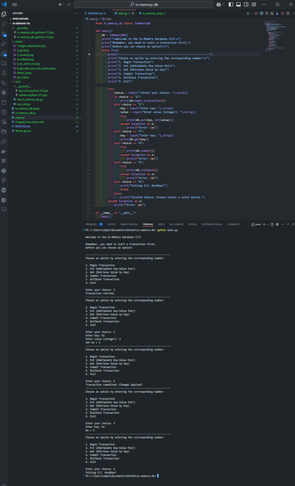

# in-memory-db
A Python implementation of an in-memory key-value database with transaction support, designed to handle atomic updates and rollback capabilities.

This project implements a simple in-memory key-value database in Python, supporting basic database operations (put, get) and transaction features like begin_transaction, commit, and rollback. The database allows atomic updates, ensuring changes are either fully applied or fully reverted.

---

## Overview

Transactions are an important part of relational databases. Transactions allow “all or nothing” updates to databases to prevent dirty writes. This is especially important while dealing with operations involving consistency, such as financial transactions.

For example:  
If you are building a money transfer app like Venmo, when User A initiates a transfer of $X to User B:
1. $X should be deducted from A’s account.
2. $X should be added to B’s account.  

If either of these steps fails, the overall accounting would be in an inconsistent state. Transactions ensure that these updates are part of a single operation that either fully succeeds or fully fails.

In this project, we will build an **in-memory key-value database** with **transaction support** using Python. The project also includes automated testing and optional GUI implementation.

---

### Functions Implemented

- **`begin_transaction()`**: Starts a new transaction.  
- **`put(key, value)`**: Inserts or updates a key-value pair within a transaction.  
- **`get(key)`**: Retrieves the value associated with the key or `None` if the key doesn't exist.  
- **`commit()`**: Applies changes made within the transaction to the main state.  
- **`rollback()`**: Aborts all changes made within the transaction.  

---

### Key Features

- **Keys as Strings and Values as Integers**:  
  The `put` method accepts a string key and an integer value.  

- **`put(key, val)` Behavior**:  
  Creates a new key with the provided value if it doesn’t exist or updates the value if it does.  

- **`get(key)` Behavior**:  
  Returns the value associated with the key or `None` if the key doesn’t exist.  

- **Exception When `put` Called Without Active Transaction**:  
  Raises a `NoActiveTransactionError` if `put` is called without an active transaction.  

- **`get(key)` Can Be Called Anytime**:  
  `get` can be called whether or not a transaction is in progress.  

- **`begin_transaction()` Starts a New Transaction**:  
  Initializes a new transaction.  

- **Only One Transaction at a Time**:  
  Raises a `TransactionAlreadyActiveError` if `begin_transaction` is called while a transaction is active.  

- **Uncommitted Changes Not Visible to `get()`**:  
  `get` retrieves values only from the committed state (`main_db`). Uncommitted changes in `transaction_log` are not visible until `commit()` is called.  

- **Transaction Ends with `commit()` or `rollback()`**:  
  Both methods reset the transaction state.  

- **`commit()` Applies Changes to Main State**:  
  Merges `transaction_log` into `main_db`, making changes visible to future `get()` calls.  

- **`rollback()` Aborts Changes**:  
  Discards `transaction_log` without altering `main_db`.  

---

#### Fig 1


```python
class InMemoryDB:
    def get(self, key: str) -> int:
        """
        Retrieves the value associated with the key from the main database.
        Returns None if the key does not exist.
        """
        pass

    def put(self, key: str, val: int):
        """
        Inserts or updates a key-value pair within a transaction.
        Raises an exception if no transaction is active.
        """
        pass

    def begin_transaction(self):
        """
        Starts a new transaction.
        Raises an exception if a transaction is already in progress.
        """
        pass

    def commit(self):
        """
        Commits the current transaction, applying all changes to the main database.
        Raises an exception if no transaction is active.
        """
        pass

    def rollback(self):
        """
        Aborts the current transaction, discarding all uncommitted changes.
        Raises an exception if no transaction is active.
        """
        pass
```

---

## Project Structure
- **`assets`**: Images
- **`tests/` Folder**:
  - **`test_in_memory_db.py`**: Sample test cases for various operations, including transaction workflows.  
  - **`test_unit.py`**: Unit tests using Python’s `unittest` framework to validate functionality.  
- **`in_memory_db.ipynb`**: Interactive Jupyter Notebook for testing and experimentation.  
- **`in_memory_db.py`**: Main implementation of the in-memory key-value database.  
- **`main.py`**: CLI menu-driven interface for interacting with the database. 
- **`tkinter_gui.py`**: A simple Tkinter-based graphical interface for visualizing and testing database operations.

    ```
    in-memory-db/
    │
    ├── assets/                  # (Optional) For GUI screenshots
    ├── tests/                   # Test folder
    │   ├── test_in_memory_db.py # Example script for manual testing
    │   ├── test_unit.py         # Unit tests using Python's unittest module
    ├── in_memory_db.ipynb       # Jupyter Notebook for interactive testing
    ├── in_memory_db.py          # Core implementation of the in-memory database
    ├── main.py                  # CLI menu-driven interface
    ├── README.md                # Project documentation
    └── tkinter_gui.py           # Tkinter GUI interface
    ```

---

## How to Run the Application

---

### Prerequisites

1. **Python Version**:
   - Ensure Python 3.11 or later is installed.
   - To check your Python version:
     ```bash
     python --version
     ```

2. **Tkinter**:
   - Included in most Python installations. To confirm or install:
     ```bash
     pip install tk
     ```

3. **Jupyter Notebook**:
   - Install Jupyter Notebook for running `.ipynb` files:
     ```bash
     pip install notebook
     ```
   - For Visual Studio Code, install the **Jupyter Notebook Extension**.

---


### Running the Application

 - **Clone the Repository**:
   ```bash
   git clone https://github.com/OzPol/in-memory-db
   ```


#### Option 1: Run the CLI Menu in Terminal

1. Navigate to the project directory:
   ```bash
   cd in-memory-db
   ```
2. Run the `main.py` file:
   ```bash
   python main.py
   ```
3. Follow the prompts in the terminal to interact with the database.


**Example CLI Screenshot**:
   

---

#### Option 2: Run the GUI Interface

1. Navigate to the project directory:
   ```bash
   cd in-memory-db
   ```
2. Run the `tkinter_gui.py` file:
   ```bash
   python tkinter_gui.py
   ```

**GUI Features**:
- **Begin Transaction**: Start a transaction before performing operations.
- **Put Key-Value Pairs**: Enter a key and value, then click "Put" to add the pair within the transaction.
- **Get**: Retrieve the value of a committed key. Displays an error if the key does not exist.
- **Commit**: Apply all changes in the transaction to the database.
- **Rollback**: Revert all uncommitted changes.


**Example GUI Screenshot**:
   

Make sure you begin a transaction before using **Put**, **Commit**, or **Rollback** to avoid errors.    
The **Get** button can be used anytime to retrieve committed values. 

---

### Option 3: Interactive Testing with Jupyter Notebook

1. Open the `in_memory_db.ipynb` file in Jupyter Notebook or Visual Studio Code.
2. Run all cells or interact step-by-step with the database.

   **Example Notebook Demo Screenshot**:
   

---

### Option 4: Running Files Individually in Visual Studio Code

1. Open the repository folder in Visual Studio Code.
2. Open the desired Python file, such as `main.py`, `tkinter_gui.py`, or any test file.
3. Run the file:
   - Click the green "Run" button in the top-right corner of VSC.
   - Or open the terminal in VSC and type:
     ```bash
     python <file_name>.py
     ```
     Replace `<file_name>` with the file you want to execute (e.g., `main.py`).

**Running Tests**:
   - Open `tests/test_unit.py` or `tests/test_in_memory_db.py`.
   - Run the files like any other program in VS Code to execute the tests.

Optionally:     

 - Run the `tests/test_unit.py` file to verify the database's functionality:
     ```bash
     python tests/test_unit.py
     ```

     or

 - Run `tests/test_in_memory_db.py` to see example scenarios in action:
     ```bash
     python tests/test_in_memory_db.py
     ```

This runs automated tests using Python's `unittest` module.

#### Examples of Test Scenarios

1. **Testing `put` without an active transaction**:
   - Calling `put` outside a transaction raises an exception.

2. **Transactional Operations**:
   - Covers end-to-end testing of operations like `begin_transaction`, `put`, `commit`, and `rollback`.
   - Verifies scenarios such as:
     - Committing changes makes them visible to `get`.
     - Rolling back a transaction discards uncommitted changes.
     - Only committed changes persist between transactions.
     - Errors are thrown when invalid operations are attempted (e.g., committing without an active transaction).

#### Example Workflow (Fig 2)

```python
# Create an instance of InMemoryDB
db = InMemoryDB()

# Start a transaction
print(db.begin_transaction())  # Output: "Transaction started."

# Add key-value pairs
print(db.put("A", 5))          # Output: "Set A = 5."
print(db.put("B", 10))         # Output: "Set B = 10."

# Commit the transaction
print(db.commit())             # Output: "Transaction committed: Changes applied."

# Retrieve values
print(db.get("A"))             # Output: "A = 5."
print(db.get("B"))             # Output: "B = 10."

# Start another transaction and rollback
print(db.begin_transaction())  # Output: "Transaction started."
print(db.put("A", 15))         # Output: "Set A = 15."
print(db.rollback())           # Output: "Transaction rolled back."

# Value remains unchanged after rollback
print(db.get("A"))             # Output: "A = 5."
```

---

### Additional Notes

- Use the CLI for command-line interaction or the GUI for a user-friendly experience.
- The Jupyter Notebook allows for step-by-step exploration of database operations.


## Suggestions for Future Improvements to the Assignment

The current assignment offers a solid foundation for understanding transaction management and implementing key database operations. 
However, certain areas of the instructions and structure could be clarified and enhanced for a better student experience and learning outcome. Below are the suggestions:

---

### 1. Clarify `get` Behavior
- The instructions state: "`get(key)` will return the value associated with the key or null if the key doesn’t exist."
- **Issue**: It's unclear whether `get(key)` should explicitly return `None` or an explanatory message like `"Key does not exist."`
- **Suggestion**: Add an explicit expectation for the return value (e.g., `None` or a message) for consistency across implementations.

---

### 2. Expected Behavior for Empty Transactions
- **Current Issue**: The instructions do not specify what happens when `commit` is called without any prior `put` operations.
- **Suggestion**: Clarify that committing an empty transaction should result in a no-op (e.g., `"No changes made"`).

---

### 3. Test Case Coverage
- While the assignment provides examples, it does not include test cases for:
  - Rolling back multiple updates within a transaction.
  - Committing a transaction after a rollback attempt.
  - Handling invalid inputs (e.g., non-integer values, empty keys).
- **Suggestion**: Provide a set of sample test cases covering edge scenarios and include them in the assignment instructions.

---

### 4. Additional Learning Opportunities
- Optionally, suggest implementing a GUI (e.g., using Python's Tkinter or another tool) to help students visualize transactions.
- Add bonus tasks, such as allowing nested transactions or implementing database persistence.

---
